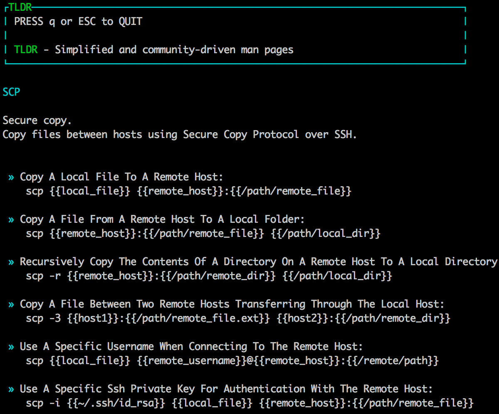

# tldr client implemented in golang #
TLDR is Simplified and community driven man page. This project provides a native tldr binary client that works in Linux, Mac OSX and Windows.

# Installing #
Native binaries are available for Linux, Mac OSX and Windows in the [Release tab](https://github.com/anoopengineer/tldr/releases).

Unzip the downloaded files and copy them to a location present in your `$PATH` (e.g `/usr/local/bin` for linux and `c:\Windows` in windows)

# TODO #

Pull requests are welcome!

1. Deb and RPM repositories
1. brew support for Mac platform
